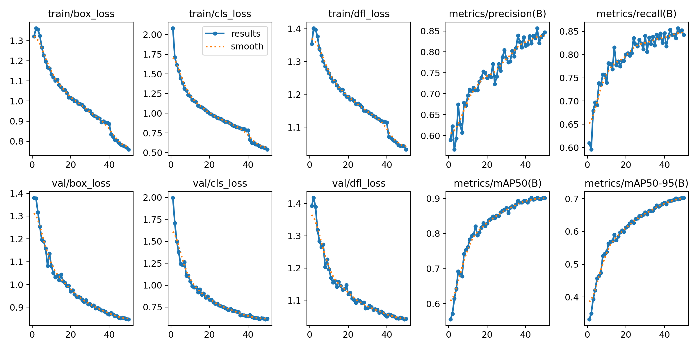
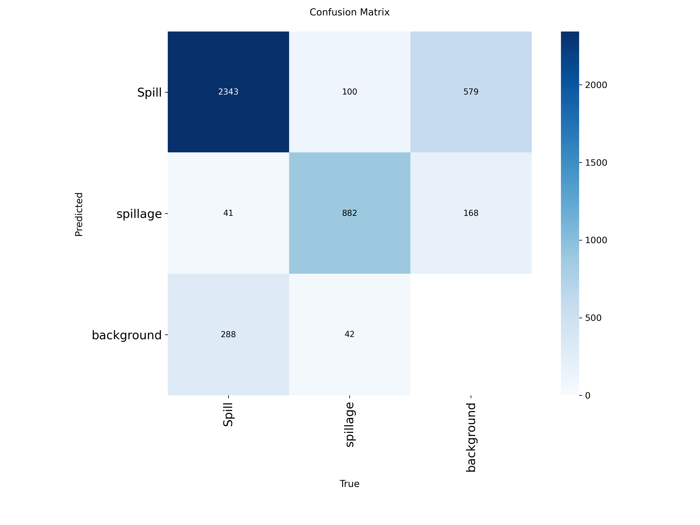

# Fluid Spill Detection Using YOLOv8

## Overview

This project is a real-time Fluid Spill Detection System built using YOLOv8 and OpenCV. The model is trained on a custom dataset containing over 13,000 annotated images and is capable of detecting fluid spills through live webcam input.

The goal of this project is to improve workplace and industrial safety by automatically identifying spills that could cause accidents, equipment damage, or hazardous conditions.

---

## Features

* Real-time fluid spill detection using webcam input
* Custom-trained YOLOv8 object detection model
* Live bounding box visualization
* Confidence score display
* Model evaluation using standard object detection metrics
* Easy deployment using Python and OpenCV

---

## Project Workflow

1. Data Collection and Preparation
2. Image Annotation in YOLO Format
3. Dataset Splitting (Training and Validation)
4. YOLOv8 Model Training
5. Performance Evaluation
6. Real-Time Webcam Deployment
7. Detection Visualization

---

## Technologies Used

* Python
* YOLOv8 (Ultralytics)
* OpenCV
* NumPy
* Google Colab
* Git & GitHub

---

## Dataset Information

| Attribute         | Details                         |
| ----------------- | ------------------------------- |
| Dataset Type      | Custom Object Detection Dataset |
| Number of Images  | 13,690+                         |
| Annotation Format | YOLO                            |
| Classes           | Fluid Spill                     |
| Task              | Object Detection                |

---

## Project Structure

```text
Fluid-Spill-Detection-Using-YOLOv8
│
├── train
│   ├── weights
│   │   ├── best.pt
│   │   └── last.pt
│   │
│   ├── results.png
│   ├── confusion_matrix.png
│   ├── F1_curve.png
│   ├── P_curve.png
│   ├── PR_curve.png
│   └── R_curve.png
│
├── screenshots
│   ├── detection1.png
│   ├── detection2.png
│   └── detection3.png
│
├── webcam.py
├── README.md
└── requirements.txt
```

---

## Installation

Clone the repository:

```bash
git clone https://github.com/ShivaniAyyappan/Fluid-Spill-Detection-Using-YOLOv8.git
```

Move into the project directory:

```bash
cd Fluid-Spill-Detection-Using-YOLOv8
```

Install dependencies:

```bash
pip install ultralytics opencv-python
```

---

## Running the Application

Start real-time webcam detection:

```bash
python webcam.py
```

The model will open the webcam and detect fluid spills in real time.

---

## Training Results

### Training Performance



### Confusion Matrix



### Precision Curve


### Recall Curve


### Precision-Recall Curve


### F1 Score Curve


---

## Detection Examples

### Example 1


### Example 2


### Example 3


---

## Applications

* Industrial Safety Monitoring
* Factory Floor Surveillance
* Laboratory Safety Systems
* Warehouse Monitoring
* Smart Building Automation
* Hazard Detection Systems

---

## Future Improvements

* Improve detection accuracy under varying lighting conditions
* Mobile deployment
* Email/SMS alert notifications
* Automatic incident logging
* Cloud-based monitoring dashboard
* Multi-class liquid classification

---

## Key Learnings

Through this project, I gained practical experience in:

* Computer Vision
* Object Detection
* YOLOv8 Training and Deployment
* Dataset Preparation and Annotation
* OpenCV Integration
* Model Evaluation
* Real-Time Inference Systems
* Git and GitHub Project Management

---

## Author

**Shivani Ayyappan**

Computer Science Engineering Student

GitHub: https://github.com/ShivaniAyyappan
